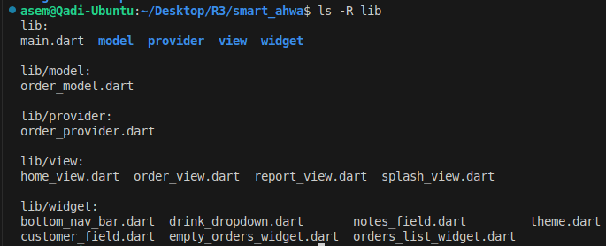
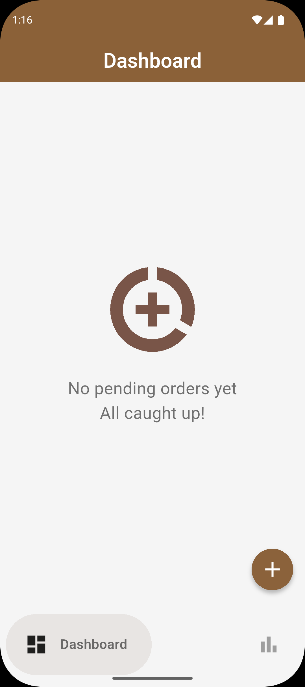
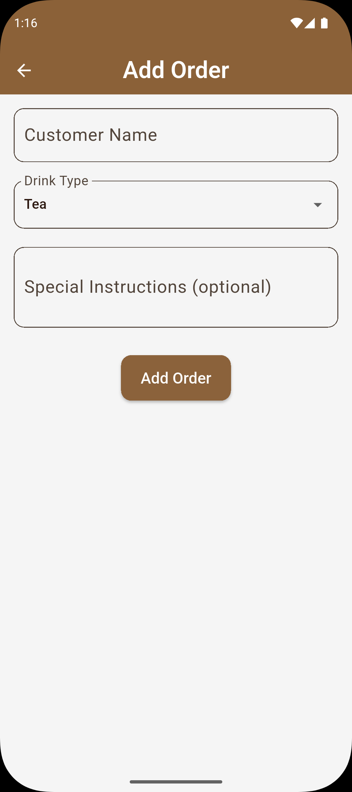
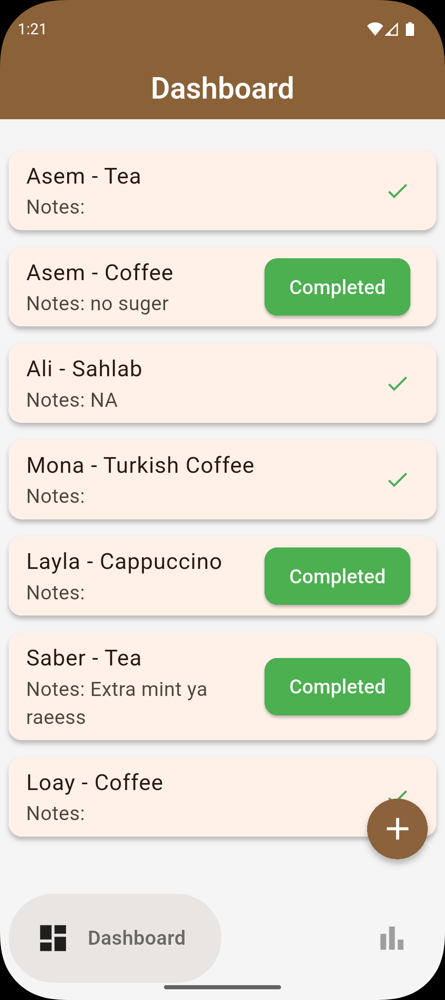
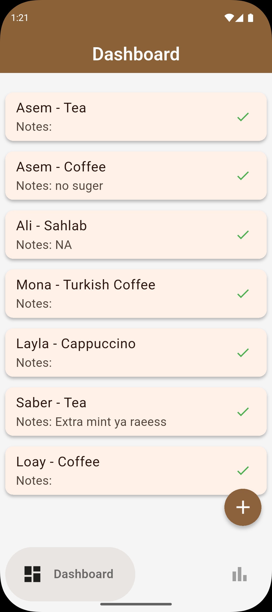
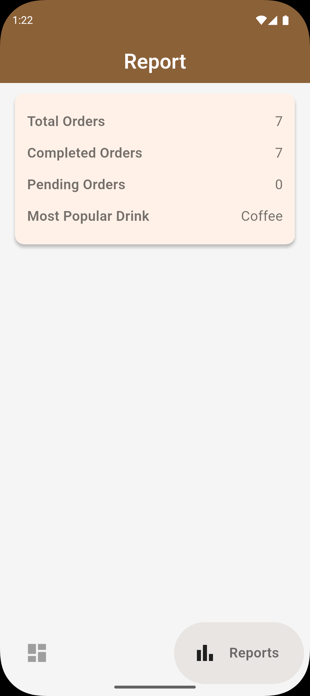

# ☕ Smart Ahwa

**Smart Ahwa** is a Flutter application designed to manage café orders easily and efficiently.
It lets you record drink orders, track pending/completed ones, and view insightful reports about the most requested drinks, Built with a clean UI, smooth animations, and a well-structured codebase following SOLID principles and OOP, making it scalable and maintainable.

---

## 🧪 Try the App

### 📱 [Download APK directly from Google Drive](https://drive.google.com/file/d/1_aMnWuAE953NeeAMwP9QeOW6EkZ-KTf5/view?usp=drive_link)

### 📷 Or scan the QR code below to see all my APKs:

---
## ✨ Features
- 📝 **Add Orders** – Record customer name, drink, and notes.

- ✅ **Update Order Status** – Mark orders as completed or leave them pending.

- 📊 **Reports** – View total orders, completed vs. pending stats, and the most popular drink.

- 🚀 **Splash** – A smooth and friendly first impression.

- 🎨 **Responsive UI** – Built with flutter_screenutil.

- 🪄 **Riverpod State Management** – Clean and scalable state handling.
---
### 🗂️ File Structure

---

### 🖼️ First
| | |
|---|---|
|  |  |

---

### 🖼️ Continue 
| | | |
|---|---|---|
|  |  |  |

---

### 🖼️ Finaly
| | |
|---|---|
|  |  |
---

## 📦 Packages Used
- [`Riverpod`](https://pub.dev/packages/riverpod) – State management.
- [`lottie`](https://pub.dev/packages/lottie) – Beautiful animations.
- [`google_fonts`](https://pub.dev/packages/google_fonts) – Custom fonts.
- [`google_nav_bar`](https://pub.dev/packages/google_nav_bar) – Modern bottom navigation bar
- [`flutter_screenutil`](https://pub.dev/packages/flutter_screenutil) – Responsive UI and scaling
- [`shared_preferences`](https://pub.dev/packages/shared_preferences) – Persistent storage for onboarding
---
## 🧑‍💻 Code Principles

✔ SOLID Principles – (e.g., Each widget/class has a single responsibility).

✔ OOP Concepts – Clean model classes (e.g., Order) and structured logic.

✔ Separation of Concerns – UI separated from business logic using Riverpod.

---
## 👨‍💻 Author

Developed with 💙 by **Asem Abdallah** (عاصم عبدالله)  

---

## 📜 License

This project is intended for learning and personal use.

---
